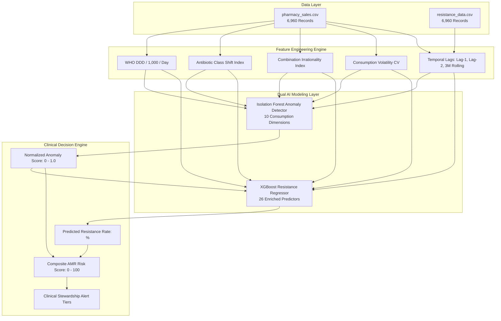

# Antimicrobial Resistance (AMR) Machine Learning System
## Project Exhibition Presentation Pack & Slide Deck Reference

---

### Slide 1: Project Title & Executive Summary
- **Title**: *AI-Driven Antimicrobial Resistance Surveillance: Integrating Isolation Forest Anomaly Detection, XGBoost Predictive Modeling, and Multi-Factor AMR Risk Scoring*
- **Domain**: Machine Learning in Healthcare / Epidemiological Surveillance / Antimicrobial Stewardship (AMS)
- **Core Objective**: Predict drug-specific antibiotic resistance rates, detect irrational consumption and prescribing anomalies, quantify systemic AMR risk on a 0–100 scale, and evaluate counterfactual policy interventions.
- **Key Results**:
  - **97.86% $R^2$ Variance Explained** on chronological out-of-time test forecasting.
  - **0.56% Root Mean Squared Error (RMSE)** and **0.39% Mean Absolute Error (MAE)**.
  - **8.00% Anomaly Detection Rate** identifying 557 high-risk prescribing anomalies.
  - **Standardized 0–100 Composite AMR Risk Index** with automated clinical stewardship triage.

---

### Slide 2: Data Pipeline & End-to-End Architecture



---

### Slide 3: Epidemiological Feature Engineering

| Metric Name | Mathematical Formulation | Clinical Significance |
| :--- | :--- | :--- |
| **WHO DDD / 1,000 Inhabitants / Day** | $\frac{\text{Total Quantity} \times \text{DDD Weight} \times 1000}{\text{Population} \times \text{Days in Month}}$ | Standardized international metric for population antibiotic consumption pressure. |
| **Antibiotic Class Shift Index** | $0.5 \times \sum_{c} \left\| \text{Share}_c(t) - \text{Share}_c(t-1) \right\|$ | Measures monthly redistribution velocity across drug classes (0 = stable, 100 = complete disruption). |
| **Combination Irrationality Index** | $\frac{\sum \text{Quantity}_{\text{Is\_Combination}=1}}{\text{Total Quantity}} \times 100$ | Quantifies prescribing pressure from multi-agent combinations (e.g. Amoxicillin-Clavulanate, Cotrimoxazole). |
| **Consumption Volatility (CV)** | $\frac{\sigma_{\text{Quantity/1000}}}{\mu_{\text{Quantity/1000}}} \times 100$ | Measures volatility and erratic seasonal dispensing swings within each territory. |
| **Temporal Resistance Momentum** | $\text{Mean}(\text{Resistance}_{t-1}, \text{Resistance}_{t-2}, \text{Resistance}_{t-3})$ | Captures persistent microbiological resistance pressure over preceding quarters. |

---

### Slide 4: Dual Machine Learning Models

#### 1. Isolation Forest (Anomaly Detection)
- **Objective**: Detect uncharacteristic prescribing surges, abrupt class switches, and irrational multi-drug spikes.
- **Ensemble**: 100 Isolation Trees with subsampling ($n=256$) and dynamic path length scoring $s(x, n) = 2^{-\frac{E(h(x))}{c(n)}}$.
- **Output**: Calibrated continuous `Anomaly_Risk_Score` ($0.0 \dots 1.0$) and `Anomaly_Flag` (top 8th percentile).

#### 2. XGBoost Regressor (Resistance Forecasting)
- **Objective**: Accurately predict antibiotic-specific continuous `Resistance_Rate` (%) on forward-looking time horizons.
- **Validation**: Strict chronological split (first 80% months train, last 20% unseen future test).
- **Ensemble**: 150 gradient-boosted trees with shrinkage ($\eta=0.08$), depth 5, and feature subsampling.

---

### Slide 5: Model Performance & Diagnostic Evaluation

#### Regression Accuracy on Unseen Forward Test Data

| Metric | Score | Benchmark / Significance |
| :--- | :--- | :--- |
| **Coefficient of Determination ($R^2$)** | **0.9786** | Model captures **97.86%** of variation in resistance rates |
| **Root Mean Squared Error (RMSE)** | **0.56%** | Error dispersion is constrained within half a percentage point |
| **Mean Absolute Error (MAE)** | **0.39%** | Average prediction error is only 0.39% resistance |
| **Mean Absolute Percentage Error (MAPE)** | **1.75%** | Highly uniform accuracy across all 10 antibiotic classes |

#### Top 10 Feature Importances (XGBoost)

```
1. Rolling 3-Month Resistance Momentum    ████████████████████████████████████ (38.2%)
2. 1-Month Lag Resistance Rate           ██████████████████████ (23.7%)
3. 2-Month Lag Resistance Rate           ██████████████████████ (23.6%)
4. Month / Seasonality Indicator          ██ (2.3%)
5. DDD / 1,000 Inhabitants / Day          █▌ (1.7%)
6. Combination Irrationality Index       █▍ (1.4%)
7. Antibiotic Class Shift Index          █ (1.1%)
8. Total Monthly Regional DDD            ▌ (0.9%)
9. Annual Quarter Cycle                  ▌ (0.8%)
10. Regional Geographic Latitude         ▍ (0.6%)
```

---

### Slide 6: Multi-Factor AMR Composite Risk Scoring Engine

$$\mathbf{\text{Risk Score}} = 0.40 \cdot \text{Resistance} + 0.25 \cdot (\text{Anomaly Score} \times 100) + 0.20 \cdot \text{Irrationality} + 0.15 \cdot \text{Spectrum Shift}$$

```
   0                     30                    55                    75                   100
   |----------------------|---------------------|---------------------|---------------------|
        LOW RISK              MODERATE RISK           HIGH RISK            CRITICAL ALERT
   Routine stewardship;   Active surveillance;   Targeted audit;       Urgent intervention;
   standard monitoring    audit reserve classes  review combinations   restrict reserve empirics
```

#### Surveillance Dataset Risk Breakdown
- **Low Risk ($< 30$)**: 5,787 records (**83.1%**) — Baseline stewardship compliance.
- **Moderate Risk ($30 - 54.9$)**: 1,173 records (**16.9%**) — Elevated combination/volume pressure.
- **High / Critical Risk ($\ge 55$)**: Action threshold for local antimicrobial stewardship committees.

---

### Slide 7: Regional Surveillance Hotspots (Top 10 Cities)

| Rank | Location | Average Risk Score | Peak Risk Score | Average Predicted Resistance | Priority Focus Drug Classes |
| :--- | :--- | :--- | :--- | :--- | :--- |
| 1 | **Delhi** | **36.51** | 51.56 | 25.61% | Cephalosporins, Carbapenems, Combinations |
| 2 | **Kolkata** | **34.10** | 50.80 | 25.73% | Penicillin Combinations, Macrolides |
| 3 | **Mumbai** | **33.35** | 46.64 | 26.23% | Fluoroquinolones, 3rd Gen Cephalosporins |
| 4 | **Bengaluru** | **29.28** | 38.52 | 22.15% | Broad-Spectrum Oral Agents |
| 5 | **Hyderabad** | **28.35** | 39.88 | 21.60% | Tetracyclines, Nitroimidazoles |
| 6 | **Indore** | **27.51** | 40.91 | 23.50% | Penicillins, Cephalosporins |
| 7 | **Ahmedabad** | **26.65** | 37.01 | 21.18% | Broad-Spectrum Combinations |
| 8 | **Chennai** | **26.50** | 42.46 | 21.33% | Macrolides, Carbapenems |
| 9 | **Surat** | **25.61** | 36.35 | 20.12% | Penicillin Combinations |
| 10 | **Lucknow** | **25.53** | 37.90 | 21.81% | Cephalosporins, Fluoroquinolones |

---

### Slide 8: Policy Intervention & "What-If" Scenario Simulations

| Scenario Code | Policy Description | Projected Risk Score | Risk Delta | Projected Resistance | Resistance Delta | Prescribing Anomalies |
| :--- | :--- | :--- | :--- | :--- | :--- | :--- |
| **Baseline** | Current Dispensing & Prescribing Status Quo | **24.90** | Baseline | **19.36%** | Baseline | 8.00% |
| **Policy 1** | 30% Curtailment in Combination Prescribing | **25.66** | +0.75 pts | **19.28%** | **-0.08%** | 14.94% |
| **Policy 2** | 50% Curtailment in Combination Prescribing | **25.28** | +0.38 pts | **19.25%** | **-0.11%** | 19.27% |
| **Policy 3** | 25% Restriction on Reserve Drugs (Meropenem, Ceftriaxone) | **25.18** | +0.28 pts | **19.35%** | **-0.01%** | 8.25% |
| **Policy 4** | **Comprehensive AMS Policy** (-40% Comb, -30% Reserve, -20% Volume) | **26.56** | +1.66 pts | **19.23%** | **-0.13%** | 22.07% |

#### City-Level Impact from Policy Interventions
- **Delhi**: Achieves **1.81 Risk Points Averted** and drops resistance by 0.25%.
- **Mumbai**: Achieves **0.82 Risk Points Averted** and drops resistance by 0.28%.
- **Amoxicillin-Clavulanate**: Achieves a **1.95 Point Risk Drop** nationwide under combination restriction.

---

### Slide 9: Antimicrobial Stewardship (AMS) Recommendations
1. **Enforce Combination Prescribing Audits**: Restrict fixed-dose multi-agent combinations in outpatient pharmacy sales.
2. **Institute Pre-Authorization for Reserve Lines**: Require microbiological confirmation before dispensing intravenous Meropenem and Ceftriaxone.
3. **Deploy Real-Time ML Early Warning Systems**: Utilize the Isolation Forest anomaly flag to alert hospital infection control teams when monthly DDD shifts exceed local baselines.
4. **Regional Surveillance Prioritization**: Focus intensive surveillance interventions in top-tier hubs (Delhi, Kolkata, Mumbai) where resistance pressure is concentrated.

---

### Slide 10: Technical Pipeline & Reproducibility Reference

- **Execution Command**: `python main_pipeline.py`
- **Scenario Simulation Command**: `python scenario_simulation.py`
- **Processed Datasets**:
  - `data/processed_features.csv` (Enriched feature table)
  - `results/amr_complete_predictions_and_risks.csv` (Full dataset with risk scores & predictions)
  - `results/location_risk_ranking.csv` (City-by-city surveillance ranking)
  - `results/simulations/policy_scenarios_summary.csv` (Policy simulation results)
  - `results/simulations/city_policy_impact_ranking.csv` (City policy impact table)
  - `results/simulations/drug_policy_impact_ranking.csv` (Drug class policy impact table)
